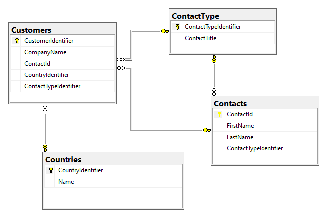

# EF Core: How to order by a Navigation property dynamically

In this article, learn how to perform order by using Entity Framework Core where order by are dynamic on navigation properties.





Typically an order by is done using code similar to this

```csharp
using var context = new NorthWindContext();
var customers = context.Customers
    .Include(c => c.Contact)
    .Include(c => c.ContactTypeNavigation)
    .OrderBy(c => c.ContactTypeNavigation.ContactTitle)
    .ToList();
```
But suppose a requirement is to allow dynamic ordering, so instead of ordering by ContactTitle the requirement is to order by a contact first or last name or their country. 

One option is shown below 

Setup an `enum` for direction of the ordering

```csharp
public enum Direction
{
    /// <summary>
    /// Sort ascending.
    /// </summary>
    Ascending,
    /// <summary>
    /// Sort descending.
    /// </summary>
    Descending
}
```

Followed by a method which accepts a property name.

```csharp
public static IQueryable<Customers> OrderByString(this IQueryable<Customers> query, string key, Direction direction = Direction.Ascending)
{
    Expression<Func<Customers, object>> exp = key switch
    {
        "LastName" => customer => customer.Contact.LastName,
        "FirstName" => customer => customer.Contact.FirstName,
        "CountryName" => customer => customer.CountryNavigation.Name,
        "Title" => customer => customer.ContactTypeNavigation.ContactTitle,
        _ => customer => customer.CompanyName
    };

    return direction == Direction.Ascending ? query.OrderBy(exp) : query.OrderByDescending(exp);
}
```

Usage

```csharp
public static async Task<List<Customers>> SortByPropertySecondAttempt(string propertyName)
{
    await using var context = new NorthWindContext();
    return await context.Customers
        .Include(c => c.CountryNavigation)
        .OrderByString(propertyName, Direction.Ascending)
        .ToListAsync();
}
```


Although this works, if a key changes or not typed in properly the method will default to the default order, `CompanyName`

A better option, rather than passing the key as a string, use a `enum`

```csharp
public enum PropertyAlias
{
    FirstName,
    LastName,
    CountryName,
    Title
}
```

Now the key is a enum which means no mistakes as with a string shown above.

```csharp
public static IQueryable<Customers> OrderByEnum(this IQueryable<Customers> query, PropertyAlias key, Direction direction = Direction.Ascending)
{
    Expression<Func<Customers, object>> exp = key switch
    {
        PropertyAlias.LastName => customer => customer.Contact.LastName,
        PropertyAlias.FirstName => customer => customer.Contact.FirstName,
        PropertyAlias.CountryName => customer => customer.CountryNavigation.Name,
        PropertyAlias.Title => customer => customer.ContactTypeNavigation.ContactTitle,
        _ => customer => customer.CompanyName
    };

    return direction == Direction.Ascending ? query.OrderBy(exp) : query.OrderByDescending(exp);
}
```

Usage

```csharp
await using var context = new NorthWindContext();
List<Customers> customers = await context.Customers
    .Include(c => c.CountryNavigation)
    .OrderByEnum(PropertyAlias.CountryName, Direction.Ascending)
    .ToListAsync();
```


# Summary

Code has been provided to perform dynamic ordering of navigation and top level properties in EF Core queries which are both loosely and strong typed which suit most needs, if a more generic method is needed that becomes a tad more complex and think that what has been presented is the way to go especially those developers that do not have experience with [reflection](https://learn.microsoft.com/en-us/dotnet/csharp/programming-guide/concepts/reflection) and working with [Expression](https://learn.microsoft.com/en-us/dotnet/csharp/programming-guide/concepts/expression-trees/). 
